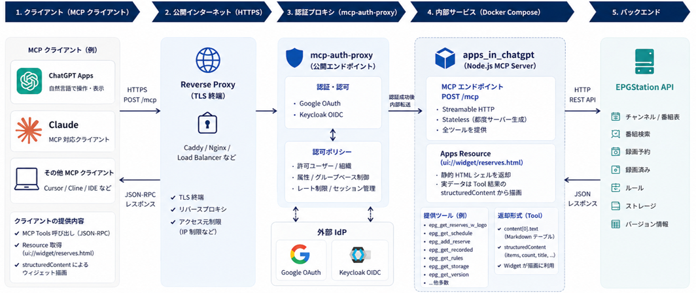

# EPGStation MCP Server



EPGStation の情報参照と録画操作を MCP 経由で公開する Streamable HTTP サーバーです。通常の MCP ツールに加えて、Apps 対応クライアント向けの HTML ウィジェットも提供します。

## 名称

- 表示名: `EPGStation MCP Server`
- ディレクトリ名 / Compose service 名: `mcp_epgstation`
- package 名: `mcp-epgstation`

## 主な機能

- EPGStation のチャンネル、番組表、番組検索、録画予約、録画済み、ルール、ストレージ、バージョン情報を MCP ツールとして公開します
- `epg_get_reserves_w_logo` でロゴ付き一覧をテキストとウィジェットの両方で返します
- `mcp-auth-proxy` を前段に配置し、Google OAuth と Keycloak OIDC で MCP エンドポイントを保護できます
- Apps 対応クライアント向けに `ui://widget/...` resource を配信します

## 動作概要

- HTTP エンドポイントは `POST /mcp` です
- 外部公開されるのは `mcp_auth_proxy` サービスで、`mcp_epgstation` 自体は Compose 内部にだけ公開されます
- サーバーは stateless で、各リクエストごとに `createMcpServer()` を呼び出します
- Apps 対応クライアントは resource を先読みするため、録画一覧ウィジェットは静的 HTML シェルを返し、実データはツール結果の `structuredContent` から描画します
- `epg_get_reserves_w_logo` は指定期間が現在日以降を含む場合は録画予約一覧を、指定期間が過去のみの場合は録画済み一覧を返します
- 日付フィルタは番組の開始時刻だけではなく、指定期間に重なる番組を含む形で適用します
- Google と Keycloak の両方を設定した場合は、`NO_PROVIDER_AUTO_SELECT=true` によりログイン画面でプロバイダを選択できます

## 前提条件

- Docker
- `docker compose` が使えること
- EPGStation API に HTTP で到達できること
- Google OAuth と Keycloak OIDC を本番運用する場合は、`EXTERNAL_URL` に対応する公開 HTTPS URL が必要です

デフォルトの接続先:

```text
http://192.168.0.XX:8888/api
```

## 環境変数

- `HOST_PORT`: ホスト側で公開する `mcp-auth-proxy` のポート。デフォルトは `3001`
- `PORT`: `mcp_epgstation` コンテナ内のポート。デフォルトは `3001`
- `EPGSTATION_URL`: EPGStation API のベース URL
- `MCP_AUTH_PROXY_IMAGE`: 認証 proxy イメージ。デフォルトは `ghcr.io/sigbit/mcp-auth-proxy:latest`
- `EXTERNAL_URL`: MCP クライアントに見せる公開 URL。パスは付けません
- `NO_AUTO_TLS`: `true` のとき、TLS は外側の reverse proxy で終端します
- `LISTEN`: `mcp-auth-proxy` の HTTP listen アドレス。通常は `:80`
- `NO_PROVIDER_AUTO_SELECT`: `true` でログイン画面に Google / Keycloak の選択肢を出します
- `HTTP_STREAMING_ONLY`: Streamable HTTP のみを受け付けます
- `GOOGLE_CLIENT_ID`, `GOOGLE_CLIENT_SECRET`: Google OAuth 用
- `GOOGLE_ALLOWED_USERS`, `GOOGLE_ALLOWED_WORKSPACES`: Google の許可対象
- `OIDC_PROVIDER_NAME`: OIDC provider の表示名。ここでは `Keycloak`
- `OIDC_CONFIGURATION_URL`: Keycloak realm の discovery URL
- `OIDC_CLIENT_ID`, `OIDC_CLIENT_SECRET`: Keycloak OIDC client 用
- `OIDC_SCOPES`, `OIDC_USER_ID_FIELD`: OIDC クレームの取り方
- `OIDC_ALLOWED_USERS`, `OIDC_ALLOWED_USERS_GLOB`: Keycloak の許可対象
- `OIDC_ALLOWED_ATTRIBUTES`, `OIDC_ALLOWED_ATTRIBUTES_GLOB`: Keycloak の属性ベース許可
- `TRUSTED_PROXIES`: 外側 reverse proxy の送信元 CIDR

設定は `.env` に定義し、`docker compose` から読み込みます。

```dotenv
HOST_PORT=3001
PORT=3001
EPGSTATION_URL=http://192.168.0.XX:8888/api
MCP_AUTH_PROXY_IMAGE=ghcr.io/sigbit/mcp-auth-proxy:latest
EXTERNAL_URL=https://mcp.example.com
NO_AUTO_TLS=true
LISTEN=:80
NO_PROVIDER_AUTO_SELECT=true
HTTP_STREAMING_ONLY=true
GOOGLE_CLIENT_ID=
GOOGLE_CLIENT_SECRET=
GOOGLE_ALLOWED_USERS=change-me@example.com
OIDC_PROVIDER_NAME=Keycloak
OIDC_CONFIGURATION_URL=https://keycloak.example.com/realms/your-realm/.well-known/openid-configuration
OIDC_CLIENT_ID=
OIDC_CLIENT_SECRET=
OIDC_ALLOWED_USERS=change-me@example.com
```

注意:

- `psethi/mcp-auth-proxy:v0.0.1` は今回必要な Google / OIDC 設定を持っていなかったため、この構成では upstream の `ghcr.io/sigbit/mcp-auth-proxy:latest` を使います
- `GOOGLE_ALLOWED_USERS` / `OIDC_ALLOWED_USERS` を空のまま provider を有効化すると、provider 側では「認証できた全ユーザーを許可」になります。安全のため初期値はダミーにしています

## セットアップ

`.env.example` をベースに `.env` を用意します。

```bash
cp .env.example .env
```

最低でも次を編集してください。

- `EXTERNAL_URL`
- `GOOGLE_CLIENT_ID`
- `GOOGLE_CLIENT_SECRET`
- `GOOGLE_ALLOWED_USERS` または `GOOGLE_ALLOWED_WORKSPACES`
- `OIDC_CONFIGURATION_URL`
- `OIDC_CLIENT_ID`
- `OIDC_CLIENT_SECRET`
- `OIDC_ALLOWED_USERS` または `OIDC_ALLOWED_USERS_GLOB` または `OIDC_ALLOWED_ATTRIBUTES`

## 起動と運用

初回起動または再ビルド込みの起動:

```bash
docker compose up --build
```

バックグラウンド起動:

```bash
docker compose up -d --build
```

停止:

```bash
docker compose down
```

ログ確認:

```bash
docker compose logs -f
```

ホスト側の `node_modules` は不要です。依存パッケージは Docker build 時にコンテナイメージ内へインストールされます。

MCP エンドポイント:

```text
http://localhost:HOST_PORT/mcp
```

実運用では `EXTERNAL_URL` に設定した HTTPS URL を使います。

```text
https://your-domain.example/mcp
```

たとえば `.env` で `HOST_PORT=3002` にすると、ローカル確認先は `http://localhost:3002/mcp` になります。

## 認証設定

### Google OAuth

Google Cloud で OAuth client を作成し、redirect URI に次を登録します。

```text
${EXTERNAL_URL}/.auth/google/callback
```

`.env` に以下を設定します。

- `GOOGLE_CLIENT_ID`
- `GOOGLE_CLIENT_SECRET`
- `GOOGLE_ALLOWED_USERS` または `GOOGLE_ALLOWED_WORKSPACES`

### Keycloak

Keycloak で OIDC client を作成し、redirect URI に次を登録します。

```text
${EXTERNAL_URL}/.auth/oidc/callback
```

`.env` に以下を設定します。

- `OIDC_PROVIDER_NAME=Keycloak`
- `OIDC_CONFIGURATION_URL=https://keycloak.example.com/realms/<realm>/.well-known/openid-configuration`
- `OIDC_CLIENT_ID`
- `OIDC_CLIENT_SECRET`
- `OIDC_ALLOWED_USERS` または `OIDC_ALLOWED_USERS_GLOB`

Keycloak の group や role で絞りたい場合は、たとえば次のように属性ベース制御も使えます。

```dotenv
OIDC_SCOPES=openid,profile,email,groups
OIDC_ALLOWED_ATTRIBUTES=/groups=mcp-users
```

## Apps 連携

Apps resource:

- `ui://widget/reserves.html`

Apps tool:

- `epg_get_reserves_w_logo`

## 提供する EPGStation ツール

チャンネル・番組表:

- `epg_get_channels`
- `epg_get_channel_logo`
- `epg_get_schedule`
- `epg_search_programs`
- `epg_get_program`

録画予約:

- `epg_get_reserves`
- `epg_get_reserve_counts`
- `epg_add_reserve`
- `epg_delete_reserve`

自動録画ルール:

- `epg_get_rules`
- `epg_enable_rule`
- `epg_disable_rule`

録画済み:

- `epg_get_recorded`
- `epg_get_recorded_detail`
- `epg_delete_recorded`

その他:

- `epg_get_encode_info`
- `epg_get_storage`
- `epg_get_version`

## `epg_get_reserves_w_logo` ツール仕様

主な引数:

- `type`: `all | normal | conflict | skip | overlap`
- `limit`: 1 から 200
- `startDate`: `YYYY-MM-DD`
- `endDate`: `YYYY-MM-DD`

返り値:

- `content[0].text`: Markdown テーブル形式の一覧
- `structuredContent.items`: ウィジェット描画用の配列
- `structuredContent.count`: 件数
- `structuredContent.title`: `録画予約一覧` または `録画済み一覧`
- `structuredContent.emptyMessage`: 0 件時の表示文言
- `structuredContent.source`: `reserves` または `recorded`

各 `items[]` の主なフィールド:

- `name`
- `channelId`
- `channelName`
- `logo`
- `startAt`
- `endAt`
- `timeText`
- `status`
- `isSkip`
- `isConflict`
- `isOverlap`

## MCP リクエスト例

ツール一覧取得:

```bash
curl -s -X POST http://localhost:3001/mcp \
	-H 'Content-Type: application/json' \
	-H 'Accept: application/json, text/event-stream' \
	-d '{"jsonrpc":"2.0","id":1,"method":"tools/list"}'
```

未来を含む期間の録画予約一覧:

```bash
curl -s -X POST http://localhost:3001/mcp \
	-H 'Content-Type: application/json' \
	-H 'Accept: application/json, text/event-stream' \
	-d '{"jsonrpc":"2.0","id":1,"method":"tools/call","params":{"name":"epg_get_reserves_w_logo","arguments":{"startDate":"2026-04-25","endDate":"2026-04-26"}}}'
```

過去のみの期間の録画済み一覧:

```bash
curl -s -X POST http://localhost:3001/mcp \
	-H 'Content-Type: application/json' \
	-H 'Accept: application/json, text/event-stream' \
	-d '{"jsonrpc":"2.0","id":1,"method":"tools/call","params":{"name":"epg_get_reserves_w_logo","arguments":{"startDate":"2026-04-23","endDate":"2026-04-25"}}}'
```

ChatGPT での自然文例:

```text
2026-04-25 から 2026-04-26 までの録画予約一覧を表示して
```

## ファイル構成

- `server.js`: HTTP サーバー本体、MCP サーバー生成、Apps resource / tool 登録
- `epgstation.js`: EPGStation API 呼び出し、各 MCP ツール実装、録画一覧データ生成、ロゴ埋め込み、ウィジェット HTML 生成
- `Dockerfile`: 本番用コンテナイメージ定義
- `docker-compose.yml`: `mcp_epgstation` と `mcp_auth_proxy` のサービス定義
- `.env`: Compose と認証 proxy を含むコンテナの環境変数定義
- `.env.example`: `.env` のサンプル
- `.dockerignore`: Docker build context から除外するファイル定義
- `package.json` / `package-lock.json`: Docker build 時に依存解決へ使う定義ファイル
- `public/reserves-widget.html`: 録画一覧ウィジェットの HTML / CSS / JS
